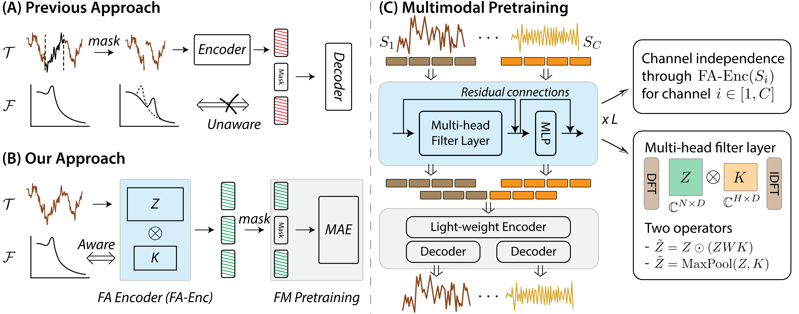

# bioFAME: Frequency-Aware Masked Autoencoders for Multimodal Pretraining on Biosignals

Publication link: [Frequency-Aware Masked Autoencoders for Multimodal Pretraining on Biosignals](https://arxiv.org/abs/2309.05927).

<p align="center">
    
</p>

Leveraging multimodal information from biosignals is vital for building a comprehensive representation of people's physical and mental states. 
However, multimodal biosignals often exhibit substantial distributional shifts between pretraining and inference datasets, stemming from changes in task specification or variations in modality compositions.
To cope with this challenge, we propose a frequency-aware masked autoencoder **bioFAME** that learns to parameterize the representation of biosignals in the frequency space.
**bioFAME** consists of a frequency-aware transformer and a frequency-maintain pretraining strategy.
The resulting architecture effectively utilizes multimodal information during pretraining, and can be seamlessly adapted to diverse tasks and modalities at test time, remaining robust to distributional shifts.
We evaluated our approach on a diverse set of transfer experiments on unimodal time series, achieving an average of 5.5% improvement in classification accuracy over the previous state-of-the-art. 
Furthermore, we demonstrated that our architecture is robust in modality mismatch scenarios, including unpredicted modality dropout or substitution, proving its practical utility in real-world applications.


## Getting Started 

#### Data preparation

- Download the multimodal sleep staging dataset through the files within the data folder.
- Download the finetuning datasets from the [TFC codebase](https://github.com/mims-harvard/TFC-pretraining/tree/main).

#### Perform pretraining

```
python -m main --data_dir YOUR-DATA-DIR --ft_data_dir YOUR-FT-DATA-DIR --reconstruction
```

#### Perform finetuning

```
python -m main --data_dir YOUR-DATA-DIR --ft_data_dir YOUR-FT-DATA-DIR --reconstruction --fine_tune --ft_new_data
```
